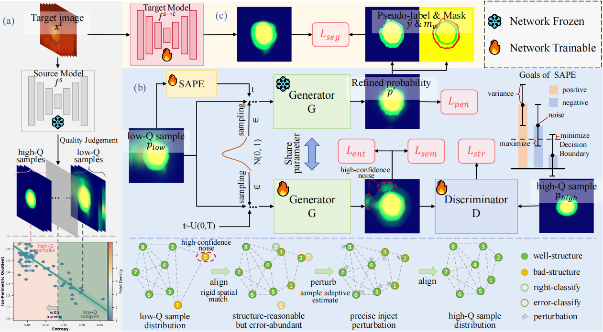

<<<<<<< HEAD
# Geometric Correspondence Constrained Pseudo-Label Alignment for Source-Free Domain Adaptive Fundus Image Segmentation
This repository contains Pytorch implementation of our source-free unsupervised domain adaptation (SF-UDA) method with geometric correspondence constrained pseudo-Label alignment (GCC).


## Introduction
[Geometric Correspondence Constrained Pseudo-Label Alignment for Source-Free Domain Adaptive Fundus Image Segmentation](https://1.pdf), AAAI 2026

Source-free unsupervised domain adaptation (SF-UDA), which relies only on a pre-trained source model and unlabeled target data, has gained significant attention. Pseudo-labeling, valued for its simplicity and effectiveness, is a key approach in SF-UDA. However, existing methods neglect the consistency priors of anatomical features across samples, leading them fail to revise of high-confidence noise in structurally inconsistent regions, ultimately manifesting as significant discrepancies in pseudo-labeled samples especially in limited source data scenarios. Motivated by this insight, we propose a novel Geometric Correspondence Constrained (GCC) pseudo-labeling framework. GCC first stratifies pseudo-labeled samples into high/low-quality subsets. It then refines low-quality samples by leveraging the anatomical features inherent in high-quality samples while injecting Gaussian perturbation to perturb high-confidence noise towards the decision boundaries. This process effectively mitigates high-confidence noise disruptive effect and preserves critical prior anatomical knowledge, making it particularly powerful for scenarios with limited source data. Experiments on cross-domain fundus image datasets demonstrate that our method achieves state-of-the-art performance.

## Installation
Create the environment from the `environment.yml` file:
```
conda env create -f environment.yml
conda activate gcc
```
## Data preparation
* Download datasets from [here](https://drive.google.com/file/d/1B7ArHRBjt2Dx29a3A6X_lGhD0vDVr3sy/view). The data was already preprocessed by [BEAL](https://github.com/emma-sjwang/BEAL).

## Training
The following are the steps for the Drishti-GS (Domain1) to RIM-ONE-r3 (Domain2) adaptation.
* Download the source domain model from [here](https://drive.google.com/file/d/1Q6Y6plO42ukCgFJzvcUMtN81br3SkY_y/view?usp=drive_link) or specify the data path in `./train_source.py` and then run `python train_source.py.`
* Save the source domain model into folder `./logs/source`.
* Download the initial pseudo label from [here](https://drive.google.com/file/d/1DCrJtsYhj6-21S01s1SuJA4Iz3pnraDA/view?usp=drive_link) or specify the model path and data path in `./generate_pseudo.py` and then run `python generate_pseudo.py`.
* Save the initial pseudo label into folder `./initial_pseudo`.
* Run `cd ./cpr` to go to the context-aware pseudo-label refinement folder.
* Download the trained context-similarity model from [here](https://drive.google.com/file/d/1eNwDtqZA2G9JsEhq4n3XyGZbYcnRK6w5/view?usp=drive_link) or specify the model path, data path and pseudo label path in `./sim_learn.py` then run `python sim_learn.py`.
* Save the context-similarity model into folder `./log`.
* Download the refined psuedo label from [here](https://drive.google.com/file/d/1vKDt0jDDQPEchiytJaAQ03qUAPerBq8m/view?usp=drive_link) or specify the context-similarity model path, data path and pseudo label path in `./pl_refine.py` then run `python pl_refine.py`.
* Save the refined pseudo label into folder `../initial_pseudo`.
* Run `cd ../gcc` to go to the geometric correspondence pseudo-label alignment folder.
* Download the trained geometric correspondence alignment model from [here](https://drive.google.com/file/d/1pxKDjQ32tnUKW5UUZ9CzSGO8Sd6Ku1Db/view?usp=drive_link) or specify the model path, data path and pseudo label path in `./train.py` then run `python train.py`.
* Save the geometric correspondence alignment model into folder `./checkpoints`.
* Download the reconed psuedo label from [here](https://drive.google.com/file/d/1ZQx34BSJxRrfqfzfnLQ5aitEYjoriLjj/view?usp=drive_link) or specify the geometric correspondence alignment model path, data path and pseudo label path in `./pseudo_recon.py` then run `python pseudo_recon.py`.
* Save the refined pseudo label into folder `./log`.
* Run `cd ../` to go to the main folder.
* Run `python train_target.py` to start the target domain training process.
## Result
cup: 0.7700 disc: 0.9446 avg: 0.8573 cup: 9.0807 disc: 4.7283 avg: 6.9045
## Drishti-GS to REFUGE adaptation
Follow the same pipeline as above, but run these commands to specify the new parameters:
```
python train_source.py
python generate_pseudo.py --dataset Domain4 --model-file /path/to/source_model
python sim_learn.py --dataset Domain4 --model-file /path/to/source_model --pseudo /path/to/pseudo_label
python pl_refine.py --dataset Domain4 --weights /path/to/context_similarity_model --pseudo /path/to/pseudo_label
python train.py --name D12D4 --dataset Domain4 --n_epochs 5 --n_epochs_decay 5 --npfilename_new /path/to/pseudo_label_new
python pseudo_recon.py --load_dir checkpoints/D12D4 --load_iter 5 --npfilename_new /path/to/pseudo_label_new
python train_target.py --dataset Domain4 --model-file /path/to/context_similarity_model --num_epochs 20
```

## Acknowledgement
We would like to thank the great work of the following open-source projects: [CPR](https://github.com/xmed-lab/CPR), [DPL](https://github.com/cchen-cc/SFDA-DPL).
